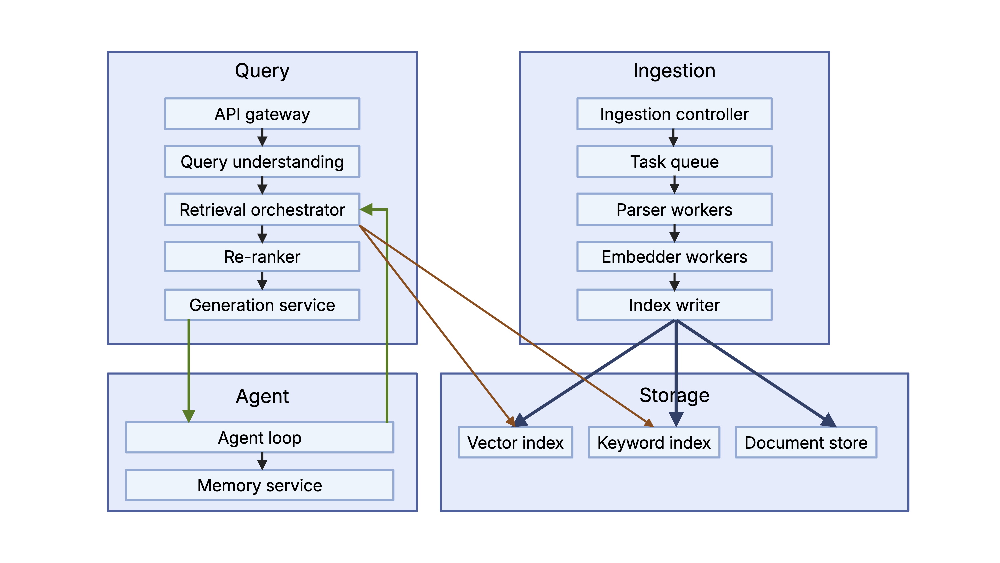

# Architectural Analysis of RAGFlow

> **References used:**
> - RAGFlow system architecture and DeepDoc documentation
> - *LLM Engineers Handbook* (Iusztin, Labonne, Vesa) — Chapter 4: RAG Feature Pipeline

---

## 1. Deep Document Understanding vs. Naive Chunking

### Why Deep Document Understanding Wins in Enterprise RAG

The LLM Engineers Handbook describes naive RAG ingestion as a simple step-by-step pipeline: extract → clean → chunk → embed → load. In this setup, chunking is one of the most important steps, but the naive approach just splits text into fixed-size pieces without really caring about meaning or structure—it basically treats the document like a stream of text and cuts it at arbitrary points. RAGFlow’s DeepDoc engine does things differently. Instead of chunking first, it looks at the document’s layout and identifies parts like titles, tables, figures, headers, and footnotes. Then it creates chunks based on these meaningful sections, so the pieces are more coherent and actually preserve the document’s structure, rather than being random fragments.

**Retrieval Fidelity**

If you split a financial table in the middle of a row because of a 512-token limit, the result stops making sense. The embedding for that chunk ends up capturing a bunch of noise instead of actual meaning. So if you ask something like “What was operating margin in Q3?”, it might retrieve a chunk that has the word “margin” but none of the actual numbers you need. With layout-aware parsing, the whole table is kept together as one unit. That way, the embedding actually reflects the real content of the table, so it can match queries in a meaningful way. The handbook connects this idea to the small-to-big technique: you use smaller, focused chunks for retrieval, but still keep access to a larger context when generating the answer. This only works if you understand the document’s structure first—otherwise, you can’t really separate what should be retrieved from what should be included as broader context.

**Index Design**

When you use layout-aware parsing, you can build a much richer index. Instead of a simple setup like {chunk_id, embedding, text}, each chunk can include more useful information, like what type of content it is (table, paragraph, figure, heading), what section it came from, and even the page number.

So your data might look something like this:

```json
{
  "doc_id": "<uuid>",
  "element_type": "table|paragraph|figure|heading",
  "section_heading": "Risk Factors",
  "page": 12,
  "chunk_text": "...",
  "embedding": [...],
  "metadata": { "source_uri": "...", "ingested_at": "..." }
}
```

Embeddings are used for search, and metadata is used to help with retrieval, so you can now do more targeted searches. For example, you can find the most relevant chunks and filter for just tables if you’re asking a numbers-based question, or only look at sections like “Risk Factors” for something compliance-related. If you use naive chunking, you lose all of this structure, so you can’t filter in a meaningfully, only as random text chunks.

**Preprocessing Cost**

The downside is pretty clear: Doing layout-aware parsing (with OCR, detecting sections, and figuring out reading order) takes more time (30–60 seconds for a 200-page PDF on a CPU), compared to milliseconds if you’re just splitting text. This cost only happens once when you ingest the document. After that, every future query benefits from the better structure, so the cost essentially evens out over time. For things like enterprise knowledge bases that get queried a lot, it’s often worth it, but if you’re only using a document once or it’s temporary, then a simpler and faster approach makes more sense.

---

## 2. Chunking Strategy: Template vs. Semantic

### Comparison

Chunking is the step you break cleaned documents into smaller pieces. This is mainly based on two things: the max input size of the embedding model, and the need to keep related content together. It also says you should use different chunking strategies depending on the type of data, which is exactly what RAGFlow does with its configurable parsers.

**Template-based chunking** is rule-based. It splits text using patterns like \n\n, headings (like # or ##), page breaks, XML tags, or domain-specific markers (like “ARTICLE” in legal docs). It’s fast, consistent, and doesn’t need any model to run. For example, the handbook’s ArticleChunkingHandler uses regex to find sentences and then groups them until hitting a max length, so the splits are predictable and easy to track.

**Embedding-driven semantic segmentation** is more dynamic. It looks at possible split points, embeds them, and checks where the meaning changes (like a drop in cosine similarity). This helps detect topic shifts, but it depends on the model, is slower, and might not be consistent across different model versions.

### Failure Analysis

 **Highly structured documents** (like 10-Ks, API docs, legal contracts):
Template chunking usually works well because the structure (headings, sections) already matches the meaning. Semantic methods can actually over-split here, since repeated or boilerplate text might look like different topics to the model, creating messy chunks.
 **Loosely structured corpora** (like chat logs, support tickets, social media):
Template chunking struggles because the structure doesn’t match meaning—messages might be unrelated even if they’re in the same paragraph, or one message might span multiple paragraphs. Semantic chunking does better here since it can pick up on topic changes, although very short messages can still make it noisy.

---

## 3. Hybrid Retrieval Architecture

### Formal Analysis

the goal of retrieval is to map the user’s query into the same vector space as the stored embeddings in the database, and then retrieve the top-K most similar chunks. It points out that cosine similarity is commonly used because it works well in high-dimensional, nonlinear embedding spaces. However, it also emphasizes that pure vector search has different failure cases than keyword-based search, which is why hybrid retrieval is important.

Let $R_L$ be the recall of lexical (BM25) retrieval and $R_V$ be the recall of dense vector retrieval over a corpus $D$. then in practice they don’t overlap perfectly. That means combining them usually improves coverage, so the union $R_L \cup R_V is better than either method alone.

**Why BM25 alone fails:**
- **Vocabulary mismatch**: If a query says “cardiac arrest” but the document says “heart attack,” BM25 won’t match them because there are no shared words, even though they mean the same thing.
- **Paraphrase and synonymy**: Any difference in wording between the query and document can cause BM25 to miss relevant results.

**Why vector-only fails:**
- **Rare entity precision**: Things like gene IDs (e.g., ENSG00000139618) or product codes need exact matching, but embeddings can blur them into nearby but incorrect meanings.
- **Exact-match requirements**: Version numbers, legal citations, and IDs are very sensitive—semantic similarity isn’t enough.
- **Domain shift**: If the embedding model wasn’t trained or adapted for a specific field, it can behave poorly on technical jargon.

**Why hybrid still has edge cases:**
- BM25 scores and cosine similarity scores don’t naturally align, so combining them requires careful normalization. Otherwise, one method can dominate the other.
- Even if you combine both, if the query is ambiguous and each method retrieves different interpretations, the system still has to guess which one is correct.
- Re-ranking (usually with a cross-encoder) helps by scoring query–chunk pairs more accurately, but it only works on already-retrieved candidates—it can’t recover results that neither BM25 nor vector search found in the first place.

---

## 4. Multi-Stage Retrieval Pipeline

### Architecture

```
Query → [Stage 1: Hybrid ANN + BM25 Candidate Generation] → top-K candidates
      → [Stage 2: Cross-Encoder Re-ranking] → top-N (N << K)
      → [Stage 3: Agent-Driven Query Refinement] → refined answer
```

### Why Multi-Stage Beats Single-Pass ANN

**Recall vs. Latency Trade-off**

The handbook explains this using the difference between bi-encoders and cross-encoders. Bi-encoders (normal embedding models) encode the query and documents separately, which lets you precompute document embeddings and do fast approximate nearest neighbor (ANN) search over large datasets—usually in just a few milliseconds even for millions of documents.

Cross-encoders work differently: they take the query and a document together as one input and produce a much more accurate relevance score. The downside is that this is expensive because you have to run it for every candidate document, so it scales linearly with K (the number of retrieved candidates). That makes it impossible to use on the full dataset at query time.

So the pipeline splits the job:

Stage 1 (ANN + BM25): focuses on speed and high recall, retrieving a broad set of possible matches.
Stage 2 (cross-encoder): focuses on precision by carefully re-ranking only a small set of candidates (like 100–500).

You can’t afford to use the re-ranking model at the initial retrieval stage because it’s too slow—so multi-stage retrieval isn’t just an optimization, it’s necessary for the system to work at scale.

**Cascading Error Propagation**

The biggest weakness of this setup is that mistakes in Stage 1 are permanent. If a relevant document never shows up in the top-K candidates, it can’t be recovered later, no matter how good the re-ranker or generator is. That’s why Stage 1 is usually designed to prioritize recall over precision. Systems often “over-retrieve” (use a large K) and combine BM25 with vector search to maximize the chance that the right document is included early. Stage 3 (agent-driven refinement) tries to fix this by adding a reasoning loop. Instead of doing retrieval just once, the model can notice missing information, rewrite the query, and run retrieval again. This gives it multiple chances to find the right context. However, this also introduces a new failure mode: the agent might keep iterating without converging on an answer. To prevent this, systems use safeguards like maximum iteration limits and confidence thresholds, as discussed in advanced RAG designs.

---

## 5. Indexing Strategy and Storage Backends

### Design Criteria

Vector databases are systems specifically built to store, index, and retrieve embeddings efficiently. Libraries like FAISS, on the other hand, are fast for similarity search but don’t really handle “database” features like updates (CRUD), metadata filtering, scaling across machines, or access control. RAGFlow’s idea of supporting multiple backends (like Elasticsearch and Infinity) reflects an important design point: there is no single best storage system for every use case. If you lock your application into one database, you eventually create migration and scaling problems later.

**Elasticsearch-like Hybrid Store**

Best for: keyword search + vector search together, plus strong metadata filtering. This works well when you need things like: full-text search (BM25), filters (date, user ID, permissions, tags), structured enterprise documents. So it’s commonly used in things like enterprise search, compliance systems, and customer support tools—basically anywhere exact keyword matching still matters a lot. The downside is that vector search is not its native strength. It’s usually added on top (like via HNSW plugins), and it may not scale or perform as well as systems built purely for embeddings, especially with very large or high-dimensional datasets.

**Vector-Native DB (Qdrant, Weaviate, Milvus)**

Best for: pure semantic search at scale. These databases are designed around embeddings from the start, so they work really well for: semantic similarity search, large and continuously growing datasets, recommendation systems or knowledge base Q&A. For example, the handbook’s LLM Twin setup uses Qdrant, where it stores: raw or cleaned documents as metadata, embeddings as vectors. 

This “dual use” setup means you don’t need a separate system just for metadata, which simplifies architecture. The trade-off is that these systems are not great at exact keyword matching. Also, if you apply very strict metadata filters, you might accidentally shrink the search space so much that the vector search can’t find good nearest neighbors anymore.

**Graph-Augmented Store (Neo4j + vector index)**

Best for: relationship-heavy or multi-hop reasoning tasks. This approach is useful when the answer depends more on connections between entities than similarity between texts. Instead of just “finding similar chunks,” the system follows relationships between nodes in a graph. This is especially good for:  compositional reasoning (combining multiple facts step by step), explainability (you can trace why an answer was produced).  Use cases include things like: compliance tracking (who is connected to what decision), medical or scientific knowledge graphs, ontology-based search systems. The downside is that building the graph from raw text is hard. You need strong entity recognition and relationship extraction, and if those are wrong, the entire reasoning chain can break downstream.

---

## 6. Query Understanding and Reformulation

### Why Static Query-to-Retrieval Fails

Users don’t usually write queries in the same way documents are stored. Queries are often short, vague, or conversational, and users leave out context they assume the system already knows. Because of this, directly sending the raw query to the index limits performance to how well the wording happens to match the stored data.

There are several common fixes for this, which are also used in systems like RAGFlow:

**Query Rewriting** means rephrasing the question into something closer to how the data is written. For example, “What causes climate change?” might become “factors contributing to global warming.” It can also break complex questions into smaller sub-questions. This helps improve retrieval before embedding the query.

**Query Expansion** adds related terms like synonyms or domain-specific variations. This improves recall because the system searches a broader set of matching concepts, but it can also introduce some noise.

**HyDE (Hypothetical Document Embeddings)** takes a different approach: the model first generates a possible answer to the question, then embeds both the original query and the generated answer. This works well when user questions are phrased differently from how answers appear in documents (question vs. statement mismatch).

**Iterative Agent-Driven Refinement vs. Static Retrieval**

In static retrieval, the system searches once and immediately answers. In contrast, an agent-based system treats retrieval like a loop: it can check if the results are incomplete, rewrite the query, search again, and combine multiple results. RAGFlow’s multi-turn optimization uses this idea directly. The trade-off is that iterative methods are more accurate for complex questions, but they cost more in latency and tokens, and they also risk running in loops if not properly constrained.

---

## 7. Knowledge Representation Layer

### Three Representations

**Dense Vector Space**

Embeddings are basically numbers that represent meaning in a continuous space, where similar meanings end up close together. This is what vector search uses (like ANN retrieval). This is great for finding “similar ideas,” but it doesn’t explain why two things are similar. It also struggles with multi-step reasoning. For example, a query like “CEO of the company that acquired Genentech, Inc. in 2009" requires combining multiple facts, which a single embedding can’t really do well. So it’s strong for similarity, but weak for reasoning and explainability.

**Relational Schema (SQL)**

Relational databases store information in structured tables with rows and columns. This makes them really good for exact queries, joins, and aggregations, and you can clearly see how a result was produced. LLMs can translate natural language into SQL queries, which is useful for filtering structured data before doing vector search. But this breaks down when the input is unstructured text, since you first have to extract structured facts from it, which can be lossy and messy.

**Knowledge Graph (RDF/LPG)**

Knowledge graphs represent information as entities and relationships between them. This makes them really good for multi-step reasoning, because you can follow paths between connected nodes. They’re also more explainable since you can trace exactly how an answer was reached. But building them from raw text is hard—you need entity and relationship extraction, and any mistakes there carry through the whole graph. They also require careful maintenance as data changes.

---

## 8. Data Ingestion Pipeline Architecture

### Robust Ingestion System Design

The handbook describes the standard ingestion pipeline as: extract → clean → chunk → embed → load. This is the basic flow for getting raw data into a RAG system. But in real production systems, you also need to handle things like different data formats, updates over time, and scaling performance.

**Schema Normalization**

Different data sources (PDFs, posts, code repos, etc.) all store metadata differently. Convert everything into a single consistent format using a shared schema (often with tools like Pydantic). The key idea is using a dispatcher pattern: each data type has its own “adapter” that knows how to clean and normalize it, and the system routes data to the right adapter at runtime. So instead of many inconsistent formats, everything becomes one unified structure like:

```json
{
  "doc_id": "<uuid>",
  "source_uri": "s3://bucket/file.pdf",
  "source_type": "pdf",
  "ingested_at": "<ISO8601>",
  "element_type": "paragraph|table|figure",
  "chunk_text": "...",
  "embedding": [...],
  "metadata": { "author_id": "...", "platform": "...", "link": "..." }
}
```

**Incremental Indexing**

A naive approach is reprocessing the entire dataset every time new data arrives, but this doesn’t scale. The handbook points out that this breaks down when data grows large. Instead, it recommends Change Data Capture (CDC), where only new or modified data gets processed. This can be done using timestamps, database triggers, or logs. The most scalable approach is log-based CDC because it captures all changes with low overhead, even though it’s more complex to set up. In systems like RAGFlow, a simple version of this is hashing documents and only re-embedding ones that have changed.

**Consistency vs. Throughput**

Ingestion systems usually care more about throughput than low latency, since data doesn’t need to be indexed instantly. Batch pipelines (often scheduled with tools like ZenML) can act as the default starting point. For higher scale, you can move to streaming using a message queue (like Kafka or Celery), where incoming documents are processed asynchronously. This improves scalability but introduces some delay before new data becomes searchable.

    A[Source Connectors] --> B[Message Queue / Kafka]
    B --> C[Parser Workers]
    C --> D[Chunker]
    D --> E[Embedder]
    E --> F[Index Writer]
    F --> G[(Vector + Keyword Index)]
    F --> H[(Document Store / Metadata)]

---

## 9. Memory Design in RAG Systems

### Three Memory Architectures

Memory is what helps RAG systems handle long conversations, not just single queries. In LLM Twin, memory is stored in two main snapshots: cleaned documents (used for training) and chunked + embedded documents (used for retrieval). This already acts like a kind of long-term memory that persists beyond one interaction. On top of that, RAG systems usually need different kinds of memory depending on how they’re used.

**Vector Memory (Semantic Recall)**

This stores past messages or documents as embeddings, so you can retrieve them based on similarity. So instead of remembering exact text, the system retrieves “related meaning” from previous conversations and adds it back into the prompt. It’s flexible and scales well, but not perfect. It can miss important past details if they don’t look semantically similar, even if they happened in the same conversation. So it’s “smart but fuzzy.”

**Structured Memory (SQL/Graph)**

This type stores extracted facts in a structured format, like: {project: "Phoenix", owner: "Alice", deadline: "Q2 2025"} Now you can query memory exactly, instead of relying on similarity. The handbook connects this to “self-query” systems, where the model turns natural language into structured filters. This is very accurate, but it depends heavily on correct extraction. If the system misreads entities or relationships, those mistakes get stored permanently.

**Episodic Logs (Temporal Traces)**

This is the simplest form: just storing everything in order with timestamps. It’s basically a full transcript of all interactions, which is great for debugging and auditing because nothing is lost. But it doesn’t scale well for long conversations, since context windows are limited. So systems usually compress or summarize these logs into shorter “working memory” versions that the model can actually use.

---

## 10. End-to-End System Decomposition

### Microservices Architecture for RAGFlow

The handbook breaks the LLM Twin pipeline into simple steps: extract → clean → chunk → embed → load, with each step running independently through an orchestrator (ZenML). In a real RAGFlow system, this idea expands into a full microservices setup split into three main parts: ingestion, query, and agent. At a high level, each part is separated so they can scale and fail independently. The following image was made using Biorender:


*Microservices Architecture for RAGFlow*

### Stateless vs. Stateful Services

Most components in the system are stateless, meaning they don’t store long-term data and can be easily scaled by just adding more replicas. These include things like parsing, embedding, retrieval, and generation services. On the other hand, stateful services store persistent data, like the vector database, keyword index, document store, and user memory. These need more careful scaling because they hold the actual system knowledge.

### Failure Isolation Boundaries

Ingestion and querying should never block each other. If ingestion slows down (like when a large batch of PDFs arrives), it should not affect query performance. This is handled using a queue between ingestion and processing, so everything runs asynchronously. On the query side, the re-ranker is often the slowest part because it uses heavy models. So if it fails or is slow, the system can just skip it and return basic ANN results instead. This keeps the system responsive even under load.

The agent loop is the most complex part because it keeps session state and can call retrieval multiple times. It needs to be carefully isolated so crashes don’t affect stored memory. Instead of directly modifying memory, the system usually writes updates through an event system, which keeps everything consistent. Memory is also versioned so past states can be recovered if something goes wrong. Overall, the idea is simple: split everything into independent services so each part can scale, fail, or update without breaking the whole system.
